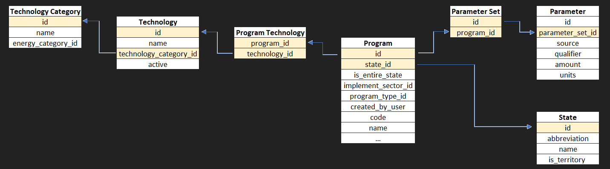

<style>                     
.navbar {
  background-color:grey;
  border-color:black;
}
.navbar-brand {
color:black!important;
}
</style>  

\pagecolor{yellow}

# Introduction 
With the expansion of solar energy throughout the United States in the past year, community solar projects have become increasingly popular. Community solar projects often consist of a partnership between the public, government entities and the business sector to install solar energy throughout a community. The outcomes of such programs can be prosperous for all entities involved. Although a seemingly common sense solution to part of the nation's energy challenge, community solar projects are a relatively new concept and spatial trends in where these projects are taking place. 

Research Question: In this analysis, the goal will be to identify what role financial incentives play in the installment of projects in the US. 

***

#Materials & Methods
1. Load any required packages:
```{r, message=F, warning=F}
#Load neccessary Libraries
library(dbplyr)
library(jsonlite)
#install.packages("xml2")
library(xml2)
library(readr)
#install.packages("readxl")
library(readxl)
library(sf)
library(ggplot2)
library(sf)
library(tidyverse)
#install.packages("spData")
library(spData)
#install.packages("maps")
library(maps)
library(formattable)
library(knitr)
library(kableExtra)
```

2. Download and clean all required data. Creating seperate tables for each source of data <br> 
* NREL - list of the community solar projects
* DSIRE (Database of State Incentives for Renewable Energy) - Multiple tables with data relating to solar power incentives 
* spData package -  Basemaps of US 
```{r, warning = FALSE, message = FALSE}
#Load in all of the DSIRE datasets
NREL_url <- "https://data.nrel.gov/files/114/NREL_Community_Solar_Project_List_6_28_2019%20FINAL.xlsx"
NREL_path <- "NREL_Community_Solar_Project_List_6_28_2019FINAL.xlsx"
NREL_Data <- read_xlsx(NREL_path, sheet = 2)
names(NREL_Data) <- c("Project", "City", "State", "Utility", "Size(kWh)","Year","Latitude", "Longitude")

Harvard_url <- "https://dataverse.harvard.edu/api/access/datafile/:persistentId?persistentId=doi:10.7910/DVN/VOQCHQ/FQ9NBF"
Harvard_Data <- read_tsv(Harvard_url)

state_geom<- map_data("state")

DSIRE_program <- read_csv("https://raw.githubusercontent.com/geo511-2019/2019-geo511-project-austin3087/master/program.csv")
DSIRE_parameter_set <- read_csv("https://raw.githubusercontent.com/geo511-2019/2019-geo511-project-austin3087/master/parameter_set.csv")
DSIRE_parameter <- read_csv("https://raw.githubusercontent.com/geo511-2019/2019-geo511-project-austin3087/master/parameter.csv")
DSIRE_state <- read_csv("https://raw.githubusercontent.com/geo511-2019/2019-geo511-project-austin3087/master/state.csv")
names(DSIRE_state)<- c("state_id", "abbreviation", "name", "is_territory")
DSIRE_program_tech <- read_csv("https://raw.githubusercontent.com/geo511-2019/2019-geo511-project-austin3087/master/program_technology.csv")
DSIRE_technology <- read_csv("https://raw.githubusercontent.com/geo511-2019/2019-geo511-project-austin3087/master/technology.csv")
DSIRE_technology_category <- read_csv("https://raw.githubusercontent.com/geo511-2019/2019-geo511-project-austin3087/master/technology_category.csv")
```

4. Join the DSIRE datasets  




```{r, warning = FALSE, message = FALSE}
#Join the DSIRE datasets by their relevant keys creating one "Final" table with relevant information. See data relationship chart above to identify how tables are related. 
DSIRE_program2 <- inner_join(DSIRE_program,DSIRE_state, by = "state_id")%>%
  inner_join(DSIRE_parameter_set, by = c("id" = "program_id"))%>%
  inner_join(DSIRE_parameter, by = c("id" = "parameter_set_id"))%>%
  inner_join(DSIRE_program_tech, by = c("id" = "program_id"))%>%
  inner_join(DSIRE_technology, by = c("technology_id" = "id"))
DSIRE_program_final <- inner_join(DSIRE_program2, DSIRE_technology_category, by = c("technology_id" = "id"))
```

5. Identify total count & mean value of awarded $ of solar incentives per state  
```{r, warning = FALSE}
#Filter table for solar photovoltaics
DSIRE_program_table <- DSIRE_program_final%>%
  filter(is_entire_state == 1)%>%
  filter(name.x.x == "Solar Photovoltaics")%>%
  filter(is_territory == 0)
kwh_total_state <- DSIRE_program_table%>%
  group_by(name.y)%>%
   summarize(Total = n())
names(kwh_total_state)<- c("State","Total")
kwh_total_state$State <- tolower(kwh_total_state$State)

kwh_mean_state <- DSIRE_program_table%>%
  group_by(name.y)%>%
  filter(units == "$")%>% #note only using $ values that are given, multiple other units given too in table but needed to be filtered for this analysis
  summarize(Total = mean(amount))
names(kwh_mean_state)<- c("State", "Average")
kwh_mean_state$State <- tolower(kwh_mean_state$State)

```

6. Create custom themes (with and without legend)
```{r, warning = FALSE}
#Create Custom theme 
theme_black_blank<- theme(
    panel.background = element_rect(fill = "transparent"), # bg of the panel
    plot.background = element_rect(fill = "#222222", color = "#222222"), # bg of the plot
    panel.grid.major = element_blank(), # get rid of major grid
    panel.grid.minor = element_blank(), # get rid of minor grid
    legend.background = element_rect(fill = "transparent"), # get rid of legend bg
    legend.box.background = element_rect(fill = "transparent"), # get rid of legend panel bg
    panel.border = element_blank(), 
    axis.title = element_blank(), 
    axis.text = element_blank(), 
    axis.line = element_line("transparent"), 
    legend.position = "none"

  )

```
7. Create spatial distribution plot to identify locations of projects
```{r, warning = FALSE}

#Plot just Community Locationsadd state geometry to DSIRE data to plot
plot1 <- ggplot()+
  geom_polygon(data = state_geom, aes(x = long, y = lat, group = group ), fill = '#222222', col = "#ba5454")+
  coord_fixed(ratio = 1.2)+
  geom_point(NREL_Data, mapping = aes(x = Longitude , y = Latitude, alpha = .85), col = "#6ca2b8")+
  theme_black_blank
```

8. Plot Spatial Distribution along w/ shaded mean incentive per state
```{r, warning = FALSE}
DSIRE_program_table2 <- full_join(kwh_mean_state, state_geom, by = c("State" = "region"))

plot2 <- ggplot()+
  geom_polygon(data = DSIRE_program_table2, aes(x = long, y = lat, group = group, fill = Average), col = "#ba5454")+
  coord_fixed(1.2)+
  geom_point(NREL_Data, mapping = aes(x = Longitude , y = Latitude), col = "#6ca2b8", alpha = .8)+
  theme_black_blank+
  scale_fill_gradient(low = "#496692", high = "#000E23")
```

9. Plot spatial distribution along w/ shaded quantity incentives per state
```{r, warning = FALSE}
DSIRE_program_table3 <- full_join(kwh_total_state, state_geom, by = c("State" = "region"))

plot3 <- ggplot()+
  geom_polygon(data = DSIRE_program_table3, aes(x = long, y = lat, group = group, fill = Total), col = "#ba5454")+
  coord_fixed(1.2)+
  geom_point(NREL_Data, mapping = aes(x = Longitude , y = Latitude), col = "#6ca2b8", alpha = .8)+
  theme_black_blank+
  scale_fill_gradient(low = "#496692", high = "#000E23")
```

10. Create Scatter plot of Average Incentive Provided vs Total # of Installations
```{r, warning = FALSE}
theme_black_scatter<- theme(
    panel.background = element_rect(fill = "transparent"), # bg of the panel
    plot.background = element_rect(fill = "#222222", color = "#222222"), # bg of the plot
    panel.grid.major = element_blank(), # get rid of major grid
    panel.grid.minor = element_blank(), # get rid of minor grid
    legend.background = element_rect(fill = "transparent"), # get rid of legend bg
    legend.box.background = element_rect(fill = "transparent"), # get rid of legend panel bg
    panel.border = element_blank(), 
    axis.title.x = element_text(color = "white"), 
    axis.title.y = element_text(color = "white"),
    axis.line = element_line(color = "white"),
    axis.text.x = element_text(color = "white"),
    axis.text.y = element_text(color = "white"),
    legend.position = "none",
    plot.title = element_text(color = "white", hjust = 0.5),
    axis.ticks = element_line(color = "white")
) 

Total_per_state <- group_by(DSIRE_program_table2, State)%>%
  dplyr::summarise(Total =  n())

DSIRE_program_table4 <- full_join(kwh_mean_state, Total_per_state, by = c("State" = "State")) %>%
  filter(Average < 20000)
  
plot4<- ggplot(DSIRE_program_table4)+
  geom_point(aes(x = Average, y = Total), col = "#6ca2b8") +
  theme_black_scatter + 
  labs(title = "Average Incentive vs Number of Installations")+
  ylab("Total Number of Installations")+
  xlab("Average Incentive ($)")
  
```

10. Create Scatter plot of Total # of Incentives vs Total # of Installations

```{r}
DSIRE_program_table5 <- full_join(kwh_total_state, Total_per_state, by = c("State" = "State"))
names(DSIRE_program_table5) <- c("","Total_Incentive", "Total_Installation")

plot5<- ggplot(DSIRE_program_table5)+
  geom_point(aes(x = Total_Incentive, y = Total_Installation), col = "#6ca2b8") +
  theme_black_scatter + 
  labs(title = "Total Number of Incentives vs Number of Installations")+
  ylab("Number of Installations")+
  xlab("Total Number of Incentives")

```


***

# Results

##Spatial Plots

###Spatial Distibution of Community Solar Installations 
```{r, fig.width=7.5, fig.height=3.88, echo = FALSE, warning = FALSE, fig.fullwidth = TRUE, fig.fullheight = TRUE, fig.align="center", fig.retina= 1}
plot1
```
__Goal:__ Identify spatially where the installations exist. 

__Description:__ This plot displays community solar installations across the US. 

__Data Source:__ This data was retrieved from NREL. 
<br>
<br>
<br>
<br>

###Spatial Distibution of Community Solar Installations w/ Incentives shaded per $ 
```{r, fig.width=7.5, fig.height=3.88, echo = FALSE, warning = FALSE, fig.align="center", fig.retina= 1}
plot2
```
__Goal:__ Identify spatial relationship on where more money is awarded for incentives. 

__Description:__ This plot displays community solar installations across the US, with state shading representing money awarded for solar incentives. A larger amount of money provided through solar incentives is equal to a darker color.  

__Data Source:__ This data was retrieved from NREL & DSIRE database.
<br>
<br>
<br>
<br>

###Spatial Distibution of Community Solar Installations w/ Incentives shaded per quantity
```{r, fig.width=7.5, fig.height=3.88, echo = FALSE, warning = FALSE, fig.align="center", fig.retina= 1}
plot3
```
__Goal:__ Identify spatial relationship on where more money is awarded for incentives. 

__Description:__ This plot displays community solar installations across the US, with state shading representing total number of solar incentives available. A larger number of solar incentives is equal to a darker color.  

__Data Source:__ This data was retrieved from NREL & DSIRE database.
<br>
<br>
<br>
<br>

##Scatter Plots
### Scatter Plot Comparing Number of Community Solar Installations w/ Average Incentive Value - Provided by NREL & DSIRE data
*Note: Average Incentive > 20,000 excluded
```{r, fig.width=7.5, fig.height=3.88, echo = FALSE, warning = FALSE, fig.align="center", fig.retina= 1}
plot4
```
__Goal:__ Identify relationship between number of solar installations and incentive value.

__Description:__ By comparing both number of solar installations and average incentive value we are able to identify if there is a clear trend relating both factors.

__Data Source:__ This data was retrieved from NREL & DSIRE database.
<br>
<br>
<br>
<br>

### Scatter Plot Comparing Number of Community Solar Installations w/ Number of Incentives - Provided by NREL & DSIRE data
```{r, fig.width=7.5, fig.height=3.88, echo = FALSE, warning = FALSE, fig.align="center", fig.retina= 1}
plot5
```
__Goal:__ Identify relationship between number of solar installations and number of incentives.

__Description:__  By comparing both number of solar installations and number of incentives we are able to identify if there is a clear trend relating both factors. 

__Data Source:__ This data was retrieved from NREL & DSIRE database

***

# Conclusion

After the analysis of the community solar projects was completed a couple conclusions could be made. 

1 - There was no clear correlation between the amount of money awarded for incentives and the amount of community solar projects present in a given state.  As seen in the first scatter plot, displaying the number of projects vs the amount of money awarded, it is evident many of the states having a higher number of projects did not have a higher value of money awarded to them. This is expected since more frequent, lower value incentives are given will create a higher number (most likely also smaller in size) number of systems. 

2 - Although, not a clear trend there appears to be more correlation between number of incentives and number of installations. The second scatter plot shows this trend, showing a higher density of number of installations for values states with less than 10 incentives. 


